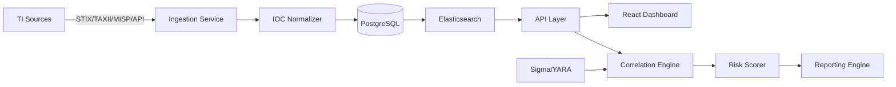

# ThreatScope – Cyber Threat Intelligence & IOC Correlation Platform


## Project Description

ThreatScope is a comprehensive Cyber Threat Intelligence (CTI) and Indicator of Compromise (IOC) correlation platform designed for modern Security Operations Centers (SOC), threat intelligence teams, and detection engineering workflows. It aggregates threat intelligence from multiple sources, correlates indicators, maps them to MITRE ATT&CK techniques, calculates risk scores, and provides interactive dashboards for threat investigation and reporting.

## Features

### Threat Intelligence & Collection
- Multi-source IOC ingestion (STIX/TAXII, MISP, OpenCTI, VirusTotal, AbuseIPDB, OTX)
- STIX 2.1 bundle parsing and normalization
- IOC types: IP, domain, URL, hash, email, YARA, Sigma
- Automated feed polling and change detection
- Data source health monitoring

### Correlation & Analysis
- Cross-source IOC correlation
- Temporal and behavioral correlation rules
- MITRE ATT&CK technique and tactic mapping
- Threat actor attribution
- Confidence scoring and deduplication

### Risk & Scoring
- Multi-factor risk scoring engine
- Contextual enrichment (geolocation, ASN, passive DNS)
- Threat landscape integration
- User-defined scoring policies
- Historical score trending

### Detection Engineering
- Sigma rule authoring and conversion
- YARA rule management
- SIEM query generation (Splunk, Elastic SIEM, Microsoft Sentinel)
- Detection coverage mapping to MITRE ATT&CK
- Rule effectiveness tracking

### Dashboard & Reporting
- Reactive dashboard (KPI cards and trend charts)
- Real-time IOC investigation
- Threat actor profiling
- Executive threat intelligence reports
- Exportable PDF and CSV reports

### Platform & Operations
- FastAPI backend with async support
- React frontend with responsive UI
- PostgreSQL + Elasticsearch persistence
- Docker Compose deployment
- GitHub Actions CI/CD
- Role-based access control
- Audit logging

## Architecture



## Tech Stack

| Layer | Technology | Purpose |
|-------|-----------|---------|
| Backend | FastAPI, Python 3.11 | REST API, async ingestion, business logic |
| Frontend | React, TypeScript, Tailwind CSS | Dashboard, IOC investigation, reports |
| Database | PostgreSQL | Structured IOC, actor, alert data |
| Search | Elasticsearch | Fast IOC search, logging, correlation |
| Cache | Redis | Rate limiting, session cache |
| Messaging | RabbitMQ | Async ingestion pipeline |
| Monitoring | Prometheus, Grafana | Metrics and health monitoring |
| Deployment | Docker Compose | Local and production deployment |
| CI/CD | GitHub Actions | Lint, test, security scan, build |

## Quick Start

### Prerequisites
- Docker & Docker Compose
- Python 3.11+
- Node.js 18+
- PostgreSQL 15+
- Elasticsearch 8.x

### Installation

```bash
# Clone the repository
git clone https://github.com/GodSpell28/ThreatScope.git
cd ThreatScope

# Start the platform
docker-compose up -d

# Verify services
curl http://localhost:8000/health
```

### Configuration

```bash
cp .env.example .env
```

Required environment variables:
- `DATABASE_URL` — PostgreSQL connection string
- `ELASTICSEARCH_URL` — Elasticsearch node URL
- `SECRET_KEY` — JWT signing key
- `VT_API_KEY` — VirusTotal API key (optional)
- `ABUSEIPDB_API_KEY` — AbuseIPDB API key (optional)

## API Documentation

Once running, access interactive API docs at:
- Swagger UI: `http://localhost:8000/docs`
- ReDoc: `http://localhost:8000/redoc`

## Security Features

- JWT-based authentication
- Role-based access control (RBAC)
- Rate limiting per endpoint
- Input validation and sanitization
- Secrets management via environment variables
- HTTPS enforcement in production
- Audit logging for all sensitive operations
- Security scanning in CI/CD pipeline

## Threat Intelligence Features

- Multi-source IOC aggregation
- STIX 2.1 format support
- TAXII 2.1 server integration
- MISP event import/export
- Automated indicator enrichment
- Threat actor profile tracking
- Campaign association

## MITRE ATT&CK Features

- Technique and tactic mapping
- Detection coverage matrix
- Technique frequency analysis
- Coverage gap identification
- Custom technique tagging
- Enterprise, Mobile, and ICS matrix support

## Sigma & YARA

- Sigma rule validation
- Sigma to SIEM query conversion (Splunk, Elastic, Sigma CLI)
- YARA rule compilation and matching
- Rule performance tracking
- Rule versioning and lifecycle management

## Testing

```bash
# Backend tests
cd backend
pytest tests/ -v --cov=app

# Frontend tests
cd frontend
npm test

# Security scans
bandit -r backend/
safety check
```

## Roadmap

- [x] Project initialization and architecture design
- [x] Backend API framework and database models
- [ ] Multi-source IOC ingestion pipeline
- [ ] Correlation engine and risk scoring
- [ ] MITRE ATT&CK integration
- [ ] React dashboard
- [ ] Sigma/YARA rule management
- [ ] Reporting and export
- [ ] Production deployment guide

## Future Enhancements

- Machine learning anomaly detection
- Threat actor TTP profiling
- Automated IOC hunting
- SIEM integration connectors
- Collaborative threat sharing
- Mobile threat intelligence
- Supply chain security analysis
- Compliance reporting (NIST, ISO 27001)

## License

MIT — see [LICENSE](LICENSE) for details.

## Author

**GodSpell28** — Cybersecurity Engineer  
GitHub: https://github.com/GodSpell28  
Email: bhaveshbhardwaj28@gmail.com

## Disclaimer

This project is built for educational and portfolio purposes. It is not intended for production use without further security hardening and compliance review.
