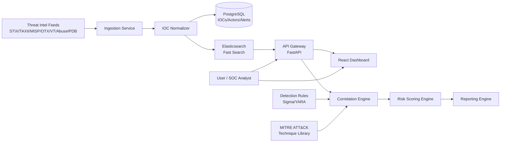
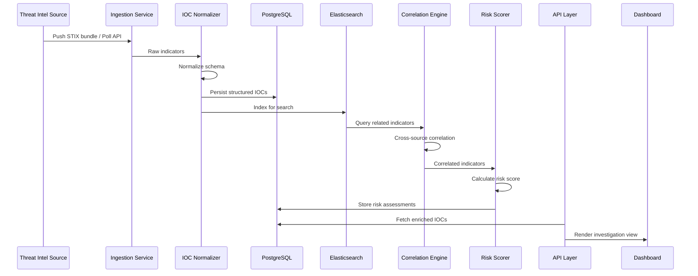
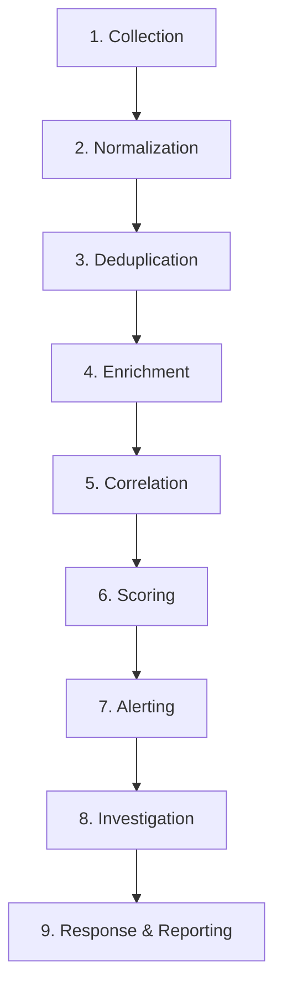
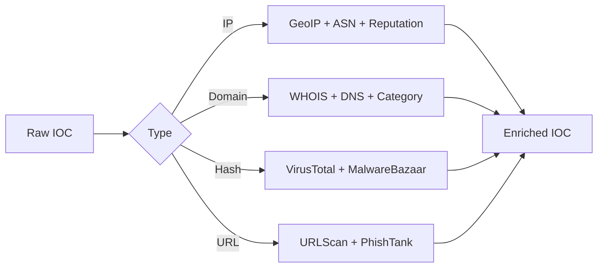
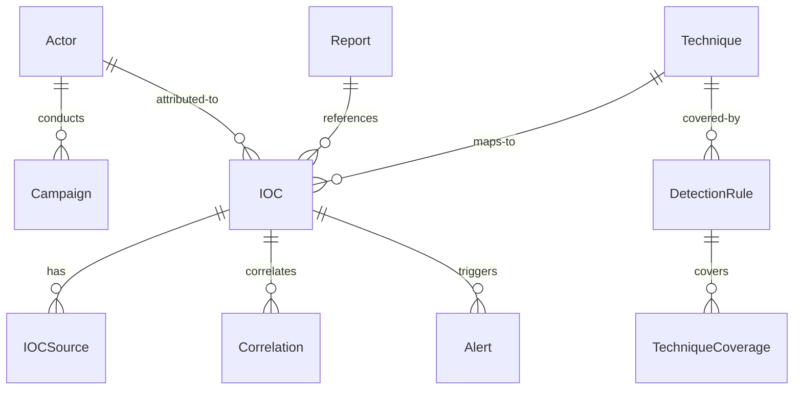

# ThreatScope – Architecture Documentation

## High-Level Architecture

## Data Flow

## Threat Intelligence Workflow

## IOC Enrichment Workflow

## Database Design

## API Design

- `POST /api/v1/ingest` — ingest STIX bundles or raw IOCs
- `GET /api/v1/iocs` — search and filter IOCs
- `POST /api/v1/iocs/{id}/enrich` — enrich a single IOC
- `POST /api/v1/correlate` — run correlation job
- `GET /api/v1/alerts` — list alerts with filters
- `POST /api/v1/score` — calculate risk score for indicators
- `GET /api/v1/mitre/coverage` — MITRE ATT&CK coverage matrix
- `POST /api/v1/sigma/convert` — convert Sigma rules to SIEM queries
- `POST /api/v1/yara/match` — match YARA rules against hashes
- `GET /api/v1/reports` — generate and retrieve reports
